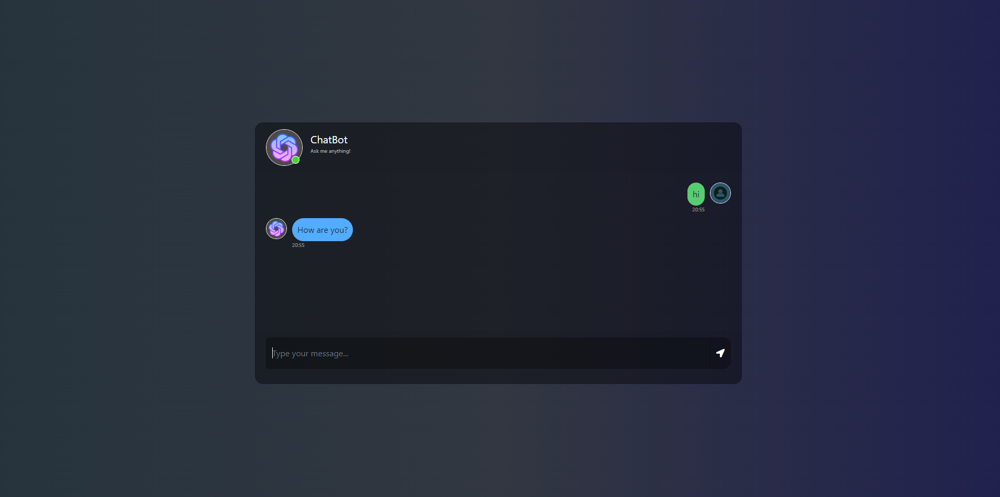

# FlaskiGPT-Conversational-AI-with-Flask-and-DialoGPT

## Features
- Interactive chat interface for engaging conversations
- Utilizes Microsoft DialoGPT for generating human-like responses
- Integration with Flask, a popular Python web framework
- Frontend built with HTML, CSS, and JavaScript for a visually appealing experience
- Efficient HTTP request handling using jQuery

## Getting Started
1. **Clone the Repository:** Begin by cloning this repository to your local machine using the following command:
git clone git@github.com:codeblooded01/FlaskiGPT-Conversational-AI-with-Flask-and-DialoGPT.git

2. **Install Dependencies:** Navigate to the project directory and install the necessary dependencies by executing the following commands:
cd flask-dialogpt-chatbot
pip install -r requirements.txt

3. **Train and Fine-tune the Model:** Follow the instructions provided in the tutorial to train and fine-tune the DialoGPT model. Improving the model's accuracy will enhance the quality of responses generated by the chatbot.

4. **Start the Application:** Launch the Flask application by running the following command:
flask run

5. **Access the Chat Interface:** Open your web browser and visit `http://localhost:5000` to access the chatbot's interface. Engage in conversations and experience the power of Microsoft DialoGPT in action.

## Contributing
We welcome contributions to enhance the functionality and features of this chatbot application. If you would like to contribute, please follow these steps:
1. Fork the repository.
2. Create a new branch for your feature or bug fix.
3. Implement your changes and ensure they are properly tested.
4. Commit and push your changes to your forked repository.
5. Open a pull request, and we will review your changes.

Let's build an intelligent chatbot together!

## License
This project is licensed under the MIT License. See the [LICENSE](LICENSE) file for more information.

## Acknowledgements
We would like to express our gratitude to the developers of Microsoft DialoGPT, Flask, HTML, CSS, JavaScript, and jQuery for their remarkable tools and frameworks that made this project possible.

## Contact
If you have any questions, suggestions, or feedback, please feel free to reach out to us at [codeblooded69@gmail.com](mailto:codeeblooded69@gmail.com)

Happy chatting with the Flask Chatbot Application! 🤖💬
